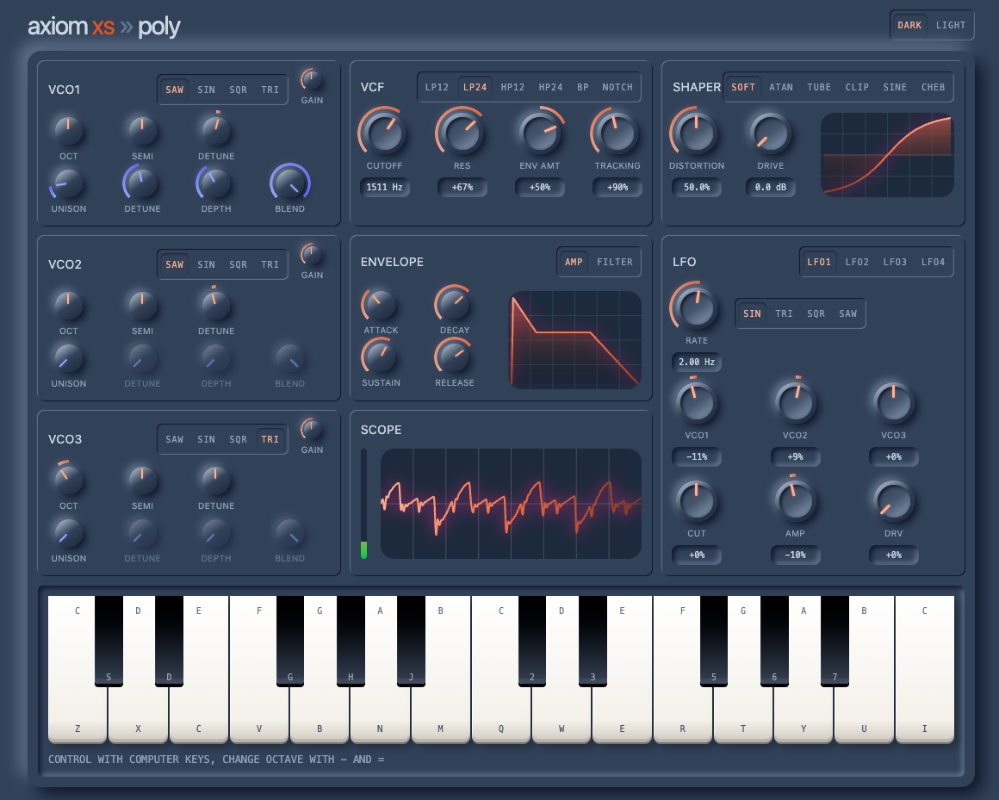

# axiom

[](https://github.com/svandriel/axiom-synth/actions/workflows/build.yml)
[](https://svandriel.github.io/axiom-synth/)

A polyphonic web synthesizer built with the Web Audio API — playable right in the
browser with your keyboard. Neumorphic UI, three detuned oscillators, a juicy
lowpass filter, dual ADSR envelopes, six waveshaper distortion character types,
and a live oscilloscope.

**Try it live: [https://svandriel.github.io/axiom-synth/](https://svandriel.github.io/axiom-synth/)**



## Features

- **Polyphonic** — 16-voice pool with smart voice stealing (3ms anti-click choke)
- **Three oscillators** — per-osc `Oct / Semi / Detune / Gain` knobs, waveform
  switch (Saw / Sin / Sqr / Tri), defaults tuned as a fat stacked-saw
- **Lowpass filter** — `Cutoff / Res / Env Amt / Tracking`, with keyboard
  tracking (0–200%) so the cutoff follows what you play
- **Dual ADSR envelopes** — Amp + Filter, each with Attack / Decay / Sustain /
  Release knobs and a live envelope graph; analog, linear, or exponential curves
- **Six waveshaper characters** — `Soft, Atan, Tube, Clip, Sine, Cheb`, each
  mapped to the `Distortion` knob; separate pre-shaper `Drive` gain. Curves are
  computed once and shared across all voices
- **Oscilloscope** — real-time waveform visualization
- **Dark / light mode** — persisted in `localStorage`
- **Keyboard playable** — computer keys map to two octaves (`z s x d c v g h n
j m` then `q 2 w 3 e r 5 t 6 y 7 u i`), `-` / `=` to shift octave, `Esc` for
  all notes off

## How it works

The synth runs entirely in the browser via the **Web Audio API** — no samples,
no external audio, everything is synthesized live.

```
Keyboard / UI knobs
  → AudioEngine        (shared control sources, 16-voice pool, master chain)
    → AxiomVoice ×16:
        3× Oscillator → Gain → WaveShaper → Lowpass → Amp Env → mix
  → dry gain → master gain → compressor → analyser → speakers
```

The engine owns all shared, per-parameter control signals
(`ConstantSourceNode`s and small observables), so turning a knob reaches every
already-playing voice live. The waveshaper curve is a single shared 1024-sample
`Float32Array` recomputed once per change and fanned out to all voices — no
16× recompute.

## Development

```bash
pnpm install
pnpm dev        # dev server on http://localhost:4000
pnpm build      # workspaces build (pnpm -r --sort build)
pnpm build:pages # build with the /axiom-synth/ base path (GitHub Pages)
pnpm format     # prettier --write
```

Stack: Vue 3 + TypeScript (strict) + Vite + Tailwind CSS v4, as a pnpm
workspaces monorepo: the Vue app lives in `app/` and the Web Audio engine in
`packages/audio-engine/`. See `docs/codebase/` for a full map of the codebase.

## Deployment

Merges to `main` build and deploy to GitHub Pages automatically via GitHub
Actions (`.github/workflows/`).
